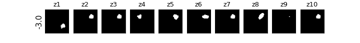
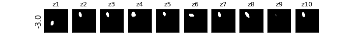
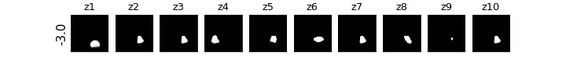
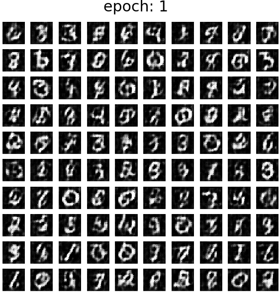

# Practice Pixyz

 

## Dependencies
* [PyTorch 0.4.1](http://pytorch.org/)
* [Pixyz](https://github.com/masa-su/pixyz)

 

## Results

### M2

解説記事: https://qiita.com/kogepan102/items/22b685ce7e9a51fbab98

### NP

### ANP

解説記事: https://qiita.com/kogepan102/items/d03bc2f0819cbf550e8d

### betaVAE

### GAN

